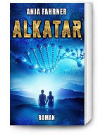
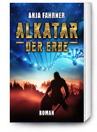
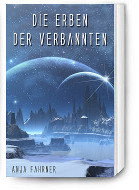

[Alex’ Projects](index.html) ► Donations / Spenden

# Donations

Little Navmap and all of my other programs are made available free of charge.

I have no plans to change this.

If you would like to show your appreciation you can donate here using PayPal:

<form action="https://www.paypal.com/cgi-bin/webscr" method="post" target="_top">
<input type="hidden" name="cmd" value="_s-xclick">
<input type="hidden" name="encrypted" value="-----BEGIN PKCS7-----MIIHdwYJKoZIhvcNAQcEoIIHaDCCB2QCAQExggEwMIIBLAIBADCBlDCBjjELMAkGA1UEBhMCVVMxCzAJBgNVBAgTAkNBMRYwFAYDVQQHEw1Nb3VudGFpbiBWaWV3MRQwEgYDVQQKEwtQYXlQYWwgSW5jLjETMBEGA1UECxQKbGl2ZV9jZXJ0czERMA8GA1UEAxQIbGl2ZV9hcGkxHDAaBgkqhkiG9w0BCQEWDXJlQHBheXBhbC5jb20CAQAwDQYJKoZIhvcNAQEBBQAEgYBD8FJm2Sl7s0kHyLV2JgnnT4GN0uQ/mmvGiIEgyWnzJqvEkkUMkzQzOv4I3K7FquvDNBoikH9FM+QZJ1au1IQh4ShpdwqKLap01cKYq8myA7MyutqEc2p1pqNZMBAh9+pMhfQ9iAdDdmgKyfHWu3wbkTWSsSmyNUZQ8OLiouK6wTELMAkGBSsOAwIaBQAwgfQGCSqGSIb3DQEHATAUBggqhkiG9w0DBwQIM5jaGY6SeW2AgdAOwm/re8NjJbVyqk0PQHHTxgJ5G5rFASfSuNFl3GQXqiqwXDjXJGcb2Jw0kLg+ae4DgEVSXm07ukisQiwqf5V1Wmi+5zZOEK8DqZPwJEnZhdIUSZBErA04jN/MbR8DlQJ9YVV0fmnUcA8iR4GS79rOqydsqONYxsBjTJl7bUwxGxmLUQz2tN58aco9rT4PV6Coh0p4RaJntBaXKQX+D/G0T3exXNnviZtvKFI7mBqIbmNCf1jXxd5TdKmIztvPZS3FyCl/Y6nFSJbC2eDIsm2LoIIDhzCCA4MwggLsoAMCAQICAQAwDQYJKoZIhvcNAQEFBQAwgY4xCzAJBgNVBAYTAlVTMQswCQYDVQQIEwJDQTEWMBQGA1UEBxMNTW91bnRhaW4gVmlldzEUMBIGA1UEChMLUGF5UGFsIEluYy4xEzARBgNVBAsUCmxpdmVfY2VydHMxETAPBgNVBAMUCGxpdmVfYXBpMRwwGgYJKoZIhvcNAQkBFg1yZUBwYXlwYWwuY29tMB4XDTA0MDIxMzEwMTMxNVoXDTM1MDIxMzEwMTMxNVowgY4xCzAJBgNVBAYTAlVTMQswCQYDVQQIEwJDQTEWMBQGA1UEBxMNTW91bnRhaW4gVmlldzEUMBIGA1UEChMLUGF5UGFsIEluYy4xEzARBgNVBAsUCmxpdmVfY2VydHMxETAPBgNVBAMUCGxpdmVfYXBpMRwwGgYJKoZIhvcNAQkBFg1yZUBwYXlwYWwuY29tMIGfMA0GCSqGSIb3DQEBAQUAA4GNADCBiQKBgQDBR07d/ETMS1ycjtkpkvjXZe9k+6CieLuLsPumsJ7QC1odNz3sJiCbs2wC0nLE0uLGaEtXynIgRqIddYCHx88pb5HTXv4SZeuv0Rqq4+axW9PLAAATU8w04qqjaSXgbGLP3NmohqM6bV9kZZwZLR/klDaQGo1u9uDb9lr4Yn+rBQIDAQABo4HuMIHrMB0GA1UdDgQWBBSWn3y7xm8XvVk/UtcKG+wQ1mSUazCBuwYDVR0jBIGzMIGwgBSWn3y7xm8XvVk/UtcKG+wQ1mSUa6GBlKSBkTCBjjELMAkGA1UEBhMCVVMxCzAJBgNVBAgTAkNBMRYwFAYDVQQHEw1Nb3VudGFpbiBWaWV3MRQwEgYDVQQKEwtQYXlQYWwgSW5jLjETMBEGA1UECxQKbGl2ZV9jZXJ0czERMA8GA1UEAxQIbGl2ZV9hcGkxHDAaBgkqhkiG9w0BCQEWDXJlQHBheXBhbC5jb22CAQAwDAYDVR0TBAUwAwEB/zANBgkqhkiG9w0BAQUFAAOBgQCBXzpWmoBa5e9fo6ujionW1hUhPkOBakTr3YCDjbYfvJEiv/2P+IobhOGJr85+XHhN0v4gUkEDI8r2/rNk1m0GA8HKddvTjyGw/XqXa+LSTlDYkqI8OwR8GEYj4efEtcRpRYBxV8KxAW93YDWzFGvruKnnLbDAF6VR5w/cCMn5hzGCAZowggGWAgEBMIGUMIGOMQswCQYDVQQGEwJVUzELMAkGA1UECBMCQ0ExFjAUBgNVBAcTDU1vdW50YWluIFZpZXcxFDASBgNVBAoTC1BheVBhbCBJbmMuMRMwEQYDVQQLFApsaXZlX2NlcnRzMREwDwYDVQQDFAhsaXZlX2FwaTEcMBoGCSqGSIb3DQEJARYNcmVAcGF5cGFsLmNvbQIBADAJBgUrDgMCGgUAoF0wGAYJKoZIhvcNAQkDMQsGCSqGSIb3DQEHATAcBgkqhkiG9w0BCQUxDxcNMTcwOTAzMTkzNzM5WjAjBgkqhkiG9w0BCQQxFgQUm4bdx7sAf8Axjd3lLvZmBrqbOz4wDQYJKoZIhvcNAQEBBQAEgYBTMl4p1urdOUgGcx1oacb/A0smxRmk1B31uUOZZ9JDlknJ6dxadsIqKRkDZdO0ipywsEUEgAaQXiYcMFIianK+Q8azBkNW3dwo1eMzzsogEXYhldwOYWQl9ybwtOSbGktYzPoIp1A68URrEMAMg6pxjk+8fz91Q3wI9OYvLHXc0w==-----END PKCS7-----
">
<input type="image" src="https://www.paypalobjects.com/en_US/i/btn/btn_donateCC_LG.gif" border="0" name="submit" alt="PayPal - The safer, easier way to pay online!">

</form>

Donations are purely optional but greatly appreciated.

# Spenden

Little Navmap und all meine anderen Programme werden kostenlos zur Verfügung gestellt.

Ich beabsichtige nicht, dies zu ändern.

Wenn Sie Ihre Wertschätzung für meine Arbeit zeigen möchten, können Sie hier per PayPal spenden:

<form action="https://www.paypal.com/cgi-bin/webscr" method="post" target="_top">
<input type="hidden" name="cmd" value="_s-xclick">
<input type="hidden" name="hosted_button_id" value="DPRLNELNQXRMA">
<input type="image" src="https://www.paypalobjects.com/de_DE/DE/i/btn/btn_donateCC_LG.gif" border="0" name="submit" alt="Jetzt einfach, schnell und sicher online bezahlen – mit PayPal.">

</form>

Falls jemand kein PayPal benutzen möchte: Mir einfach eine E-Mail schicken und ich sende meine Kontoverbindung zurück.

Spenden sind vollkommen freiwillig.

# Science Fiction (German/Deutsch)

Alternativ würde ich mich auch darüber freuen, wenn Sie das Projekt meiner Frau Anja Fahrner \([**Autorenseite**](https://www.anja-fahrner.de)\) anschauen.

Sie schreibt gesellschaftskritische Science-Fiction- bzw. Fantasy-Romane und Kurzgeschichten.

Vielleicht ist etwas zum Verschenken oder für Sie selbst dabei.

[**Alkatar**](http://www.anja-fahrner.de/meine-buecher-und-geschichten/alkatar) \(Taschenbuch 15 €, eBook 4,95 € und Kindle Unlimited\)

**Neu:** [**Alkatar - Der Erbe**](http://www.anja-fahrner.de/meine-buecher-und-geschichten/alkatar-der-erbe) \(Taschenbuch 16 €, eBook 4,95 € und Kindle Unlimited\)

[**Die Erben der Verbannten**](http://www.anja-fahrner.de/meine-buecher-und-geschichten/die-erben-der-verbannten) \(Kurzgeschichte, eBook 0,99 € und Kindle Unlimited\).

## Rezensionen zu Alkatar

### Amazon

19.04.2017 - [Eine Reise ins unbekannte…](https://www.amazon.de/review/RPDCSSTJNOXR1/ref=cm_cr_dp_title?ie=UTF8&amp;ASIN=B01H7E4A20&amp;channel=detail-glance&amp;nodeID=530484031&amp;store=digital-text)

18.04.2017 - [Ich bin begeistert...](https://www.amazon.de/review/R1VVGH9HNJ9BWN/ref=cm_cr_dp_title?ie=UTF8&amp;ASIN=B01H7E4A20&amp;channel=detail-glance&amp;nodeID=530484031&amp;store=digital-text)

07.04.2017 - [Empfehlenswert](http://amzn.to/2nMiLXv)

05.04.2017 - [Die sehr gelungene Vermischung zweier Welten](https://www.amazon.de/review/R1S5GQMV82FZIL/ref=cm_cr_dp_title?ie=UTF8&amp;ASIN=B01H7E4A20&amp;channel=detail-glance&amp;nodeID=530484031&amp;store=digital-text)

27.02.2017 - [Spannende Science Fiction mit Gesellschaftskritik](https://www.amazon.de/gp/customer-reviews/RPEI98W3343YC/ref=cm_cr_arp_d_rvw_ttl?ie=UTF8&amp;ASIN=B01H7E4A20)

15.02.2017 - [Eine andere Welt und doch zugleich unsere Welt](https://www.amazon.de/gp/customer-reviews/R14DJDGW8XHVG7/ref=cm_cr_arp_d_rvw_ttl?ie=UTF8&amp;ASIN=B01H7E4A20)

23.12.2016 - [Spannende Fantasy-Dystopie über menschliche Werte](https://www.amazon.de/gp/customer-reviews/RLAOES1N02G37/ref=cm_cr_arp_d_rvw_ttl?ie=UTF8&amp;ASIN=1533142807)

21.11.2016 - [Sehr schöne SciFi-Geschichte mit einen kleinen Fantasy-Anteil](https://www.amazon.de/review/R3NROM08AHFRB/ref=cm_cr_dp_title?ie=UTF8&amp;ASIN=1533142807&amp;channel=detail-glance&amp;nodeID=299956&amp;store=books)

19.11.2016 - [Großartige Geschichte- Alkatar](https://www.amazon.de/gp/customer-reviews/R1FRAVSCOISLVQ/ref=cm_cr_getr_d_rvw_ttl?ie=UTF8&ASIN=1533142807)

14.11.2016 - [Alkatar aus meiner Sicht](https://www.amazon.de/gp/customer-reviews/R4GS2NTPCW4MC/ref=cm_cr_arp_d_rvw_ttl?ie=UTF8&amp;ASIN=1533142807)

03.11.2016 - [Phantastische Gechichte](https://www.amazon.de/gp/customer-reviews/R26V6JPO4D4AHA/ref=cm_cr_arp_d_rvw_ttl?ie=UTF8&amp;ASIN=1533142807)

23.10.2016 - Rezension Alkatar

28.09.2016 - Spannende Science-Fiction

19.08.2016 - Eine spannende und tiefgründige Gesellschaftskritik

17.08.2016 - Gelungene SciFi-Fantasy Geschichte

15.08.2016 - Keine klassische Science Fiction

11.08.2016 - Für Sciene-Fiction-Fans ein Muss!

28.07.2016 - Alkatar = absolut lesenswert für Science-Fiction-Fans

28.06.2016 - Phantastische Unterhaltung, deutsche Science Fiction

[Mehr Rezensionen auf Amazon ...](http://www.amazon.de/review/1533142807)

### LovelyBooks

14.06.2017 - [Alkatar – eine sehr gelungene Sience-Fiction-Geschichte](https://www.lovelybooks.de/autor/Anja-Fahrner/Alkatar-1355166186-w/rezension/1465050702/)

18.03.2017 - [Tolle Sci Fi Geschichte I Love it](https://www.lovelybooks.de/autor/Anja-Fahrner/Alkatar-1249858569-w/rezension/1441044572/)

14.09.2016 – [Ein kritischer Sci-Fi Roman mit Liebe zum Detail](http://www.lovelybooks.de/autor/Anja-Fahrner/Alkatar-1249858569-w/rezension/1322501146/)

12.08.2016 – [Dieses Buch ist für mich etwas sehr Besonderes](http://www.lovelybooks.de/autor/Anja-Fahrner/Alkatar-1249858569-w/rezension/1278577466/)

05.08.2016 – [Realistischer ,gesellschaftskritischer Sciencefictionroman](http://www.lovelybooks.de/autor/Anja-Fahrner/Alkatar-1249858569-w/rezension/1267076399/)

03.08.2016 – [Soll das die Zukunft sein?](http://www.lovelybooks.de/autor/Anja-Fahrner/Alkatar-1249858569-w/rezension/1263886931/)

[Mehr Rezensionen auf LovelyBooks ...](http://www.lovelybooks.de/autor/Anja-Fahrner/Alkatar-1249858569-w)
