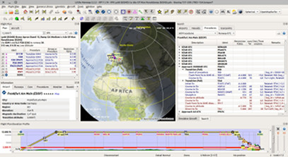
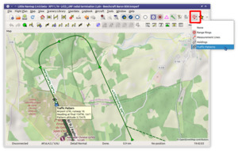
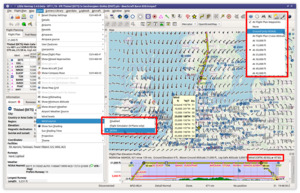
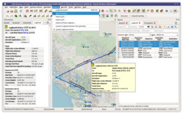
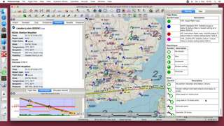
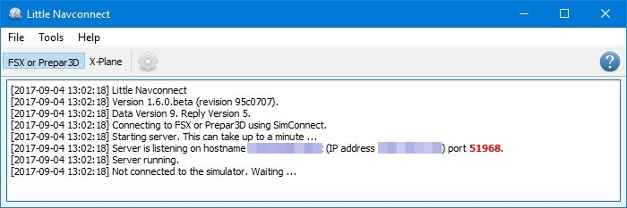

<!-- VERSION_NUMBER_TODO -->

# Alex' Projects

##  News

  
    

  
      {{ post.date | date: "%Y-%m-%d, %H:%M" }} <a href="{{ site.baseurl }}{{ post.url }}">► {{ post.title }}</a>
    
      
{{ post.date | date: "%Y-%m-%d, %H:%M" }} - <a href="{{ site.baseurl }}{{ post.url }}">{{ post.title }}</a>

    
    

  

[**► News Archive**](archive.html)

## Little Navmap Downloads

  <b>
    Little Navmap is free. Ask for a refund if you have paid for it.
  </b>

  <b>
    Only download Little Navmap from these trusted places: 
    <a style="color: #a00000;" href="https://github.com/albar965/littlenavmap/releases">► GitHub - Little Navmap Releases</a> 
    <a style="color: #a00000;" href="https://forums.x-plane.org/index.php?/files/file/41694-little-navmap/">► X-Plane.Org</a> 
    <a style="color: #a00000;" href="https://albar965.github.io/downloads.html">► Alternative Download Locations</a> 
    Third-party download sites are beyond my control, may offer outdated versions, and might be compromised.
  </b>

#### Latest Stable Release

[**► Windows 64-bit Installer \(*MSFS and X-Plane*\)** - LittleNavmap-win64-{{ page.release-version }}-Install.exe](https://github.com/albar965/littlenavmap/releases/download/v{{ page.release-version }}/LittleNavmap-win64-{{ page.release-version }}-Install.exe) 
[**► macOS** - LittleNavmap-macOS-{{ page.release-version }}.zip](https://github.com/albar965/littlenavmap/releases/download/v{{ page.release-version }}/LittleNavmap-macOS-{{ page.release-version }}.zip) 
[**► Linux \(64 bit, based on Ubuntu 22.04\)** - LittleNavmap-linux-22.04-{{ page.release-version }}.tar.gz](https://github.com/albar965/littlenavmap/releases/download/v{{ page.release-version }}/LittleNavmap-linux-22.04-{{ page.release-version }}.tar.gz)

**Other Versions:**

[► Windows 32-bit Installer \(*only for FSX and P3D*\) - LittleNavmap-win32-{{ page.release-version }}-Install.exe](https://github.com/albar965/littlenavmap/releases/download/v{{ page.release-version }}/LittleNavmap-win32-{{ page.release-version }}-Install.exe) 
[► Linux \(64 bit, based on Ubuntu 20.04 for Debian or older systems\) - LittleNavmap-linux-20.04-{{ page.release-version }}.tar.gz](https://github.com/albar965/littlenavmap/releases/download/v{{ page.release-version }}/LittleNavmap-linux-20.04-{{ page.release-version }}.tar.gz)

Zipped Windows releases without installer are available in the alternative download locations below or from the release assets at [GitHub - Little Navmap Releases - Version {{ page.release-version }}](https://github.com/albar965/littlenavmap/releases/v{{ page.release-version }}) \(scroll down to `Assets`\).

**► [Alternative Download Locations](/downloads.html)**

## Little Navmap Links

[**► User Manuals**](/manuals.html)

[**► Screenshots**](littlenavmapscreens.html)

-----

[**► Contact and Support**](contact.html) Links, support forum and email.

[**► Support Forum at _Avsim_**](https://www.avsim.com/forum/780-little-navmap-little-navconnect-little-logbook-support-forum) Support and help for users.

[**► Frequently asked Questions**](littlenavmap-faq.html) Solutions for known problems and more.

[**► Install Navigraph Updates**](littlenavmap_navigraph.html) Shows how to update the included Navigraph database to the latest cycle.

[**► Downloads**](https://www.littlenavmap.org/downloads) Aircraft performance profiles and more.

[**► Useful Software**](links.html) A link collection of helpful tools as well as open source tools used to create *Little Navmap*.

[► GitHub Profile](https://github.com/albar965) All my projects, releases, source code, issue lists and more.

## Little Navmap Donations

|   | **Donate to show your appreciation if you like my programs.**  **Spenden Sie, um Ihre Wertschätzung zu zeigen, wenn Ihnen  meine Programme gefallen.** |

## Little Navmap {#littlenavmap}

 **_Little Navmap_** is a free open source flight planner, navigation tool, moving map,
airport search and airport information system for **Flight Simulator X, Prepar3D, Microsoft Flight Simulator 2020, X-Plane 11 and  X-Plane 12** is available for **Windows, Apple macOS and Linux**.

**_Little Navmap_ does not track its users and does not display advertisements.**

_Little Navmap_ comes with a **detailed user manual including several tutorials** which is available online as well as in PDF and other formats like EPUB.
**Help buttons** in all relevant areas of the program display corresponding chapters in the online manual on click.

A cycle 1801 database courtesy of Navigraph is included in the download and includes navaids,
airways, airspaces, procedures and more. The **navigation data can be updated using the [Navigraph
FMS Data Manager](https://navigraph.com/apps/navigation-data/fms-data-manager)** (subscription required).

| ---- | ---- |
|  |  |

A widely configurable **map display** using the OpenStreetMap as a background map which is only one
option of many online and included offline maps. The map shows airports, navaids (VOR, NDB, ILS and
more), MORA (minimum off-route altitude) altitude grid, MSA (minimum sector altitude) diagrams,
airways, en-route holdings, airspaces, oceanic tracks, high altitude winds, AI or multiplayer
aircraft and ships as well as airport weather and winds aloft. A seamlessly integrated **airport
diagram** displays taxiways, displaced thresholds, overrun areas, aprons, parking spots and more.

Users can place **airport traffic patterns**, **holdings** or **minimum sector altitude diagrams** for visual guidance on the map.

Unlike static charts, *Little Navmap* allows you to customize the way the map is displayed.

| ---- | ---- |
|  |  |

It supports **approach and departure procedures like SIDs, STARs and final approaches**, offers a
widely configurable **automatic flight plan calculation** and **several export formats** like GFP (Reality XP GTN
and Flight1 GTN), FPL (Reality XP GNS), GPX, RTE, FLP and X-Plane FMS as well as drag and drop
flight plan editing on the map. The program can read the PLN, FMS and FLP and more flight plan formats.

Selecting departure and destination runways allows to have extended runway center lines and vertical guidance in the elevation profile.

Several flight plan formats can be exported using the **flight plan multiexport** feature with one click.

Flight plans can be easily exchanged with **SimBrief**.

**Keyboard shortcuts** help to access most functions without mouse.

An **elevation profile** is shown for the flight plan allowing to find a safe cruise altitude also
displaying top of climb, top of descent and procedure altitude restrictions. Calculated and shown
climb as well as descent paths adhere to altitude restrictions.

**Aircraft performance and fuel planning** is included which automatically considers winds aloft for
fuel, top of climb and top of descent calculation. Performance values can be collected
automatically during flight and can be merged into the currently profile at any time.

**Search** functionality allows to look for airports, navaids, procedures, user defined waypoints and
logbook entries by a large amount of criteria also including a spatial search.

Userpoint functionality allow to place, edit and export **user defined features like points of
interest**, visual reporting points and more on the map. Import and export of CSV, X-Plane and Garmin
files.

_Little Navmap_ comes with its own **logbook** allowing to automatically record, search and edit
logbook entries. The logbook records the flight plan and the flown track which can be exported to
GPX files.

**Oceanic and other tracks** like NAT can be downloaded, shown on the map and can be used for
automatic flight plan calculation.

| ---- | ---- |
|  |  |

The program can generate an **ATS route description** from flight plans and vice versa where the output
is widely configurable.

Display of clients and centers of **VATSIM, IVAO, PilotEdge** and custom online networks.

_Little Navmap_ features its own internal **web server** which allows to follow aircraft progress from
any device across a network.

**Supported Flight Simulators:** All FSX versions from SP2 up, Flight Simulator - Steam Edition,
Prepar3D v4, v5, v6, Microsoft Flight Simulator 2020, X-Plane 11 and X-Plane 12.

**Supported platforms:** Windows 7/8/10/11, Apple macOS (High Sierra 10.13 or later) and Linux (64 bit only).

## Little Navconnect {#littlenavconnect}

 **_Little Navconnect_** is a
small free open source application that acts as an agent connecting *Little Navmap* with a flight
simulator remotely across the network.

**_Little navconnnect_ is included in the download archive of *Little Navmap*.**

**Supported Flight Simulators:** All FSX versions from SP2 up, Flight Simulator - Steam Edition,
Prepar3D v4, v5, v6, Microsoft Flight Simulator 2020, X-Plane 11 and X-Plane 12.

**Supported platforms:** Windows 7/8/10/11, Apple macOS (High Sierra 10.13 or later) and Linux (64 bit only).

[**► User manuals for _Little Navmap_ and _Little Navconnect_**](/manuals.html)

[► GitHub _Little Navconnect_ Project and Sources](https://github.com/albar965/littlenavconnect)

----

## Little Xpconnect {#littlexpconnect}

 **_Little Xpconnect_** is a X-Plane plugin that
allows *Little Navmap* and *Little Navconnect* to connect to X-Plane.

It is light weight, free and open source.

**_Little Xpconnect_ is included in the download archive and installation of *Little Navmap*. Do not try to download it elsewhere.**

The plugin can be easily installed from within *Little Navmap* in menu `Tools` -> `Install Little Xpconnect in X-Plane Plugins`.

**Supported Flight Simulators:** X-Plane 11 and X-Plane 12.

**Supported platforms:** Windows 7/8/10/11, Apple macOS (High Sierra 10.13 or later) and Linux (64 bit only).

[**► _Little Navmap_ User Manual - Little Xpconnect**](https://www.littlenavmap.org/manuals/littlenavmap/release/latest/en/XPCONNECT.html)

[► GitHub _Little Xpconnect_ Project and Sources](https://github.com/albar965/littlexpconnect)

