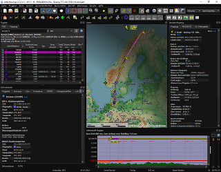

# Alex' Projects

##  News

  
    

  
      {{ post.date | date: "%Y-%m-%d, %H:%M" }} <a href="{{ site.baseurl }}{{ post.url }}">► {{ post.title }}</a>
    
      
{{ post.date | date: "%Y-%m-%d, %H:%M" }} - <a href="{{ site.baseurl }}{{ post.url }}">{{ post.title }}</a>

    

    

  

[**► News Archive**](archive.html)

## Links {#links}

<a href="alex AT littlenavmap DOT org"
   rel="nofollow"
   onclick="this.href='mailto:' + 'alex' + '@' + 'little' + 'nav' + 'map' + '.' + 'org'"
   onmouseleave="this.href='alex AT littlenavmap DOT org'">► Contact me by email (English / Deutsch)</a>

[**► User manuals for _Little Navmap_ and _Little Navconnect_ in all formats and languages.**](/manuals.html)

[**► Support Forum at Avsim**](https://www.avsim.com/forum/780-little-navmap-little-navconnect-little-logbook-support-forum) **Support and help for users.**

[**► Little Navmap - Frequently asked Questions**](littlenavmap-faq.html) <!--[**► Oft gestellte Fragen**](littlenavmap-faq_de.html)-->

[**► Little Navmap - Install Navigraph Updates**](littlenavmap_navigraph.html) Shows how to update the included Navigraph database to the latest cycle.

[**► Little Navmap Downloads - Aircraft Performance**](https://www.littlenavmap.org/downloads/Aircraft%20Performance)

[**► GitHub Profile**](https://github.com/albar965) All my projects, releases, source code, issue lists and more.

[**► About Translation Packages**](littlenavmaptranslations.html) General information about translation packages.

[**► Donations / Spenden**](donate.html)

**Donate to show your appreciation if you like my programs.**

**Spenden Sie, um Ihre Wertschätzung zu zeigen, wenn Ihnen meine Programme gefallen.**

## Little Navmap {#littlenavmap}

| ---- | ---- |
|  |  |

 [**► Little
Navmap**](littlenavmap.html) is a free open source flight planner, navigation tool, moving map,
airport search and airport information system for Flight Simulator X, Prepar3D and X-Plane.

A widely configurable map display using the OpenStreetMap as a background map which is only one
option of many online and included offline maps. The map shows airports, navaids, airways,
airspaces, AI or multiplayer aircraft and ships as well as airport weather and winds aloft. A seamlessly integrated airport diagram displays
taxiways, displaced thresholds, overrun areas, aprons, parking spots and more.

Use can place airport traffic patterns or holdings on the map.

It supports approach and departure procedures like SIDs, STARs, custom final approaches, offers several automatic flight
plan calculation options and multiple export formats like GFP \(Reality XP GTN and Flight1 GTN\),
FPL \(Reality XP GNS\), GPX, RTE, FLP and X-Plane FMS as well as
drag and drop flight plan editing on the map. The program can read the PLN, FMS and FLP flight plan
formats.

An elevation profile is shown for the flight plan allowing to find a safe cruise altitude also displaying top climb,
top of descent and procedure altitude restrictions.

Aircraft performance and fuel planning is included which automatically considers winds aloft for fuel, top of climb and top of descent calculation. Performance values can be collected automatically during flight.

Search functionality allows to look for airports, navaids or procedures by a large amount of
criteria also including a spatial search.

_Little Navmap_ comes with its own logbook allowing to automatically record, search and edit logbook entries.

The program can generate an ATS route description from flight plans and vice versa where the output is widely configurable.

The nav database can be updated by the _Navigraph FMS Data Manager_. A cycle 1801 database is included.

Complete edit, display, import and export functionality for user defined waypoints.
Import and export of CSV, X-Plane and Garmin files.

Display of clients and centers of VATSIM and custom online networks.

_Little Navmap_ features its own internal web server which allows to follow aircraft progress from any device.

**Supported Flight Simulators:** All FSX versions from SP2 up, Flight Simulator - Steam Edition,
Prepar3D v2, v3, v4 and X-Plane 11.

**Supported platforms:** Windows 7/8/10, macOS \(10.10 or newer only\) and Linux \(64 bit only\).

## Little Navconnect {#littlenavconnect}

 [**► Little
Navconnect**](littlenavconnect.html) is a
small free open source application that acts as an agent connecting *Little Navmap* with a flight
simulator. This allows to use *Little Navmap*
on Linux or macOS and saves the the pain of setting up remote SimConnect links for FSX or Prepar3D.

**Supported Flight Simulators:** All FSX versions from SP2 up, Flight Simulator - Steam Edition,
Prepar3D v2, v3, v4 and X-Plane 11.

**Supported platforms:** Windows 7/8/10, Apple macOS and Linux \(64 bit\).

## Little Xpconnect {#littlexpconnect}

 **Little Xpconnect** is a X-Plane plugin that
allows *Little Navmap* and *Little Navconnect* to connect to X-Plane.

It is light weight, free and open source.

*Little Xpconnect* is included in the download archive of [Little Navmap](littlenavmap.html).

**Supported Flight Simulators:** X-Plane 11 \(64 bit\).

**Supported platforms:** Windows 7/8/10, Apple macOS and Linux.

[**► Readme and Installation**](https://github.com/albar965/littlexpconnect/blob/release/1.0/README.txt)

[**► Downloads and Releases**](https://github.com/albar965/littlexpconnect/releases)

