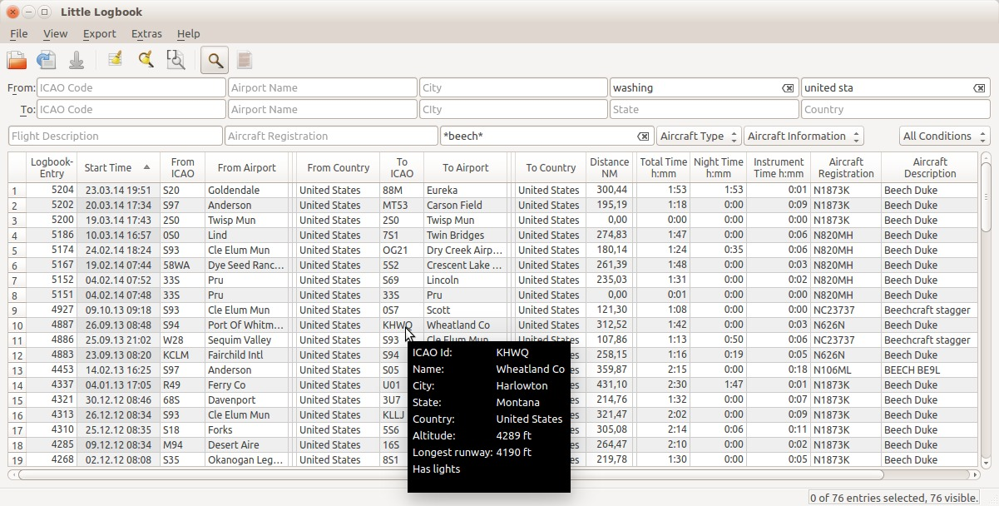
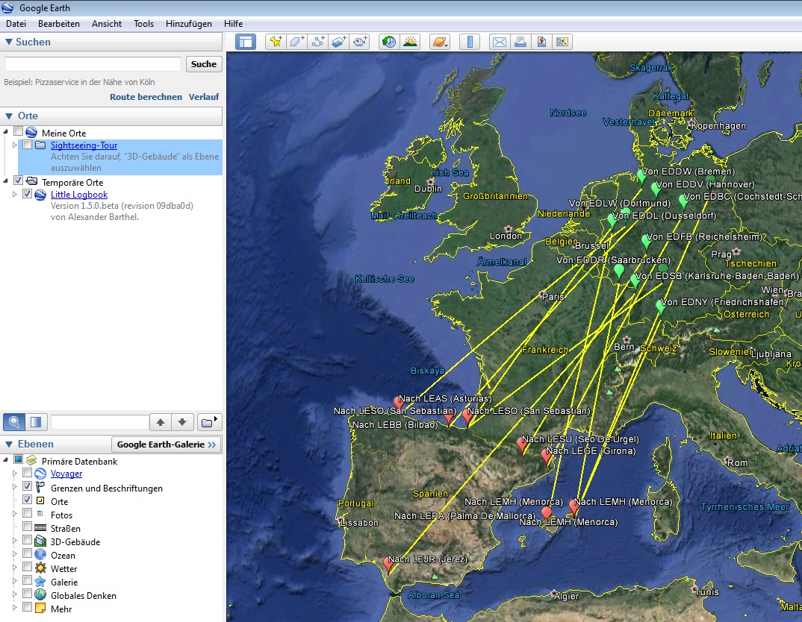
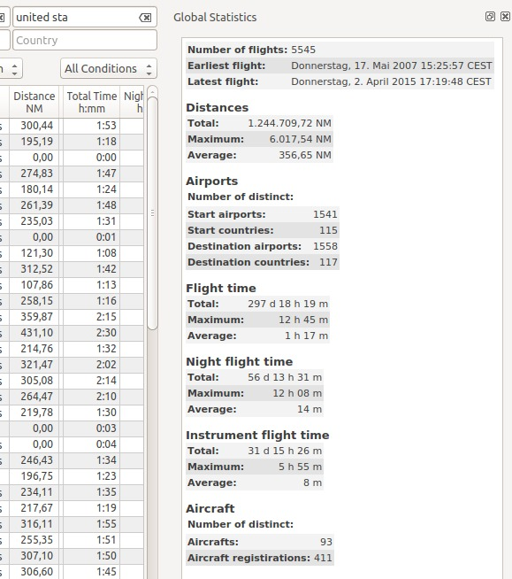

[Alex’ Projects](index.html) ► Little Logbook
#  Little Logbook

## Links

[**► Releases and Downloads**](https://github.com/albar965/littlelogbook/releases)

[► Help English (Version 1.5.0)](https://albar965.github.io/littlelogbook/help/en/index.html)

[► Hilfe Deutsch (Version 1.5.0)](https://albar965.github.io/littlelogbook/help/de/index.html)

[► GitHub Little Logbook Project](and Sources https://github.com/albar965/littlelogbook)

**Supported Flight Simulators:** All FSX versions from SP2 up and Flight Simulator - Steam Edition.

**Supported platforms:** Windows XP/7/8/10.

**Little Logbook is not compatible with Lockheed Martin Prepar3D v4 and later.**

## Screenshots

Click on image for full size.

----
**Main Window with Search and Tooltip on Airport ICAO (Version 1.0.2):**

----
**Google Earth KML Export (Version 1.5.0):**

----
**Statistics Dock Window (Version 1.0.2):**

