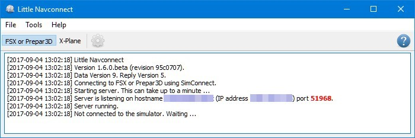

[Alex’ Projects](index.html) ► Little Navconnect
#  Little Navconnect

*Little Navconnect* is a free open source application that acts as an agent connecting *Little Navmap* with a flight simulator. This allows to use *Little Navmap* on remote, Linux or macOS computers and saves the the pain of setting up SimConnect links across a network.

*Little Navconnect* also allows to connect to the *Little Xpconnect* X-Plane plugin.

## Links {#links}

**Little Navconnect is included in the download archive of [Little Navmap](littlenavmap.html).**

Downloading it separately is normally not needed.

[► **Releases and Downloads**](https://github.com/albar965/littlenavconnect/releases)

[► Online User Manual](https://albar965.gitbooks.io/little-navconnect-user-manual/content/en/)

[► GitHub Little Navconnect Project and Sources](https://github.com/albar965/littlenavconnect)

## Screenshots {#screenshots}

----
**Little Navconnect running and waiting for a simulator:**

----
**Little Navconnect options dialog:**

