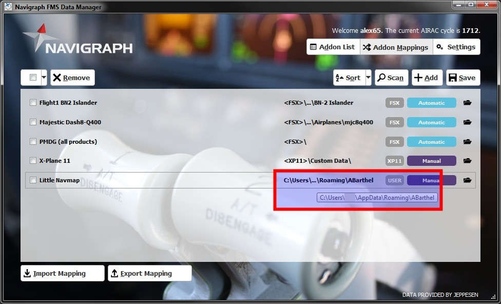

[Alex’ Projects](index.html) ► Little Navmap - Install Navigraph Updates
#  Little Navmap - Install Navigraph Updates

## Scenery Library Menu

You will see the AIRAC cycle of the Navigraph database in the menu `Scenery Library`. Use this to confirm a successfull update.

See [Little Navmap User Manual - Scenery Library Menu](https://www.littlenavmap.org/manuals/littlenavmap/release/latest/en/MENUS.html#scenery-library-menu) for more information on the menu.

## Please Note

* **I recommend to use the automatic scan in the [Navigraph FMS Data Manager](https://navigraph.com/apps/navigation-data/fms-data-manager)
which usually finds the correct path.**
* **Use the method below only if the automatic scan does not work for you.**
* **Close _Little Navmap_ when updating its database. The program might crash or the update might silently fail.**

### macOS Users

If the automatic scan does not find the folder for _Little Navmap_ you have to add the mapping manually  as shown below for Windows users.

When you add the mapping manually in the _FMS Data Manager_ it should read `/Users/YOURUSERNAME/.config/ABarthel`.

But macOS does not allow to select this directory since it is hidden. Therefore you have to apply a trick:

If the folder selection box is open press `Command+Shift+.` (period) keys to show the hidden files (i.e. all files and folders that start with a period). Then you can get into `.config` and select the folder `ABarthel`.

### Windows Users

See screenshots below.

#### Select Little Navmap in Addon Mappings:

#### Select the User Defined Folder option:

#### Select the correct Folder
**Do _not_ select** `little_navmap_db` **.**

#### The finished mapping ready to update:

## Manual Installation {#manual}

You can also download the manual update from your Navigraph account. Close *Little Navmap* before copying the files.

Go to [Navigraph - Manual Downloads](https://navigraph.com/downloads) and search for `Little Navmap`.
You probably have to login before. Download the Zip archive for Linux no matter which operating system you use.

You will get a file like `lnm_native_2211.zip`.

Extract the archive and copy the included file `little_navmap_navigraph.sqlite` over `C:\Users\YOURUSERNAME\AppData\Roaming\ABarthel\little_navmap_db\little_navmap_navigraph.sqlite`. Overwrite the file.

**Paths for other operating systems:**

-  macOS: `/Users/YOURUSERNAME/.config/ABarthel/little_navmap_db/little_navmap_navigraph.sqlite`
-  Linux: `$HOME/.config/ABarthel/little_navmap_db/little_navmap_navigraph.sqlite`

