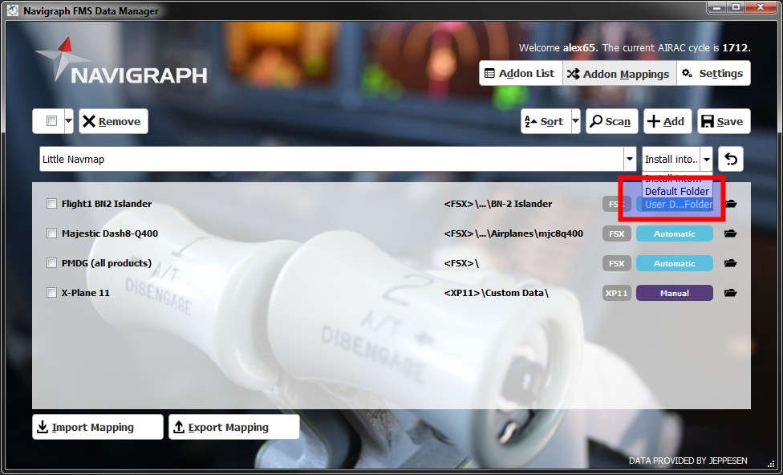

[Alex’ Projects](index.html) ► Little Navmap - Install Navigraph Updates
#  Little Navmap - Install Navigraph Updates

## Select Little Navmap in Addon Mappings:

## Select the User Defined Folder option:

## Select the correct Folder 
**Do _not_ select** `little_navmap_db` **.**

## The finished mapping ready to update:

