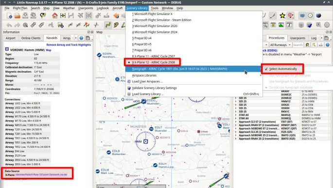

**Translate this page on the fly into your language using** [Google Translate](https://translate.google.com/translate?sl=en&u=https%3A%2F%2Falbar965.github.io%2Flittlenavmap_simdata.html).

[Alex’ Projects](index.html) ► Little Navmap - Install KEYVAN SIMDATA Navdata Updates for X-Plane

# Using SIMDATA with X-Plane 11 and 12 in Little Navmap

**Note: _Little Navmap_ currently supports SIMDATA only when it is installed for X-Plane 11 or X-Plane 12. An update to _Little Navmap_ in the coming months will improve functionality and ensure compatibility with all simulators.**

SIMDATA from **[KEYVAN](https://www.keyvan.aero)** is a native navigation data package built specifically for X-Plane 11 and 12. It provides global, AIRAC-compliant navigation data with the accuracy and reliability trusted by real-world airlines and training organizations.

With SIMDATA, you can use the same high-quality aeronautical data inside _Little Navmap_ for flight planning and navigation.

After purchasing your SIMDATA subscription from the Keyvan Store or SimMarket, you will receive access to the SIMLOVERS Control Panel. This software manages your downloads and automatically updates X-Plane every AIRAC cycle.

1. **Log in to the Control Panel**

   - Install and open the Simulator NavData Downloader (SIMLOVERS).
   - Enter the email address you used for your subscription.
   - Create a password (first login only).
   - If needed, you can reset your password using `Forgot My Password!`.

2. **Select Simulator Path**

   - Click `Open` to select your X-Plane 11 or 12 installation folder.
   - Press `Add` to save the simulator path.
   - The selected path will now appear in your profile list.

3. **Download and Install NavData**

   - From the Control Panel, choose the saved profile.
   - Click `Update`.
   - The software will automatically download and install the latest AIRAC NavData into your X-Plane `Custom Data` folder.

**Download the [2024_SIMLOVERS USER GUIDE.pdf](https://www.littlenavmap.org/simdata/2024_SIMLOVERS%20USER%20GUIDE.pdf) for detailed instructions.**

## Notes

* Each subscription includes 13 AIRAC cycles per year.
* Each account has 1 download per cycle.
* The subscription is valid for one year; renewing extends your access.

## Verification in Little Navmap

* In _Little Navmap_, go to the menu `Scenery Library` -> `Load Scenery Library`.
* Select either X-Plane 11 or 12 and click `Load`.
* _Little Navmap_ will automatically use the updated X-Plane navdata and display updated procedures (SIDs, STARs, approaches, waypoints, navaids) based on SIMDATA.
* As a result, you will see the updated cycle in the _Little Navmap_ title bar.
  *   For example: `Little Navmap 3.0.17 - X-Plane 12 2508 / (N) - *`. The part `X-Plane 12 2508` indicates that _Little Navmap_ uses the updated SIMDATA cycle installed in `Custom Data`. `(N)` indicates that the included Navigraph cycle is ignored. See the [Little Navmap User Manual - Window Title](https://www.littlenavmap.org/manuals/littlenavmap/release/latest/en/INTRO.html#window-title) for a full explanation of the window title bar.
  *   Note that the included Navigraph navdata database still shows up as 1801 in the menu. This is not an issue since the database is not used.

Once everything is installed and loaded, _Little Navmap_ should look like this (click image to enlarge):

Note the updated AIRAC cycle 2508 for X-Plane. Ensure `Select automatically` is enabled to use the correct navdata source, which is the X-Plane simulator data from `Custom Data`.

You can also see the X-Plane navdata file reference to `Custom Data` in the information panel in the `Data Source` section after clicking on a navaid like a VOR, NDB or waypoint.

See [Little Navmap User Manual - Navigation Databases](https://www.littlenavmap.org/manuals/littlenavmap/release/latest/en/NAVDATA.html) for more information about data sources.
