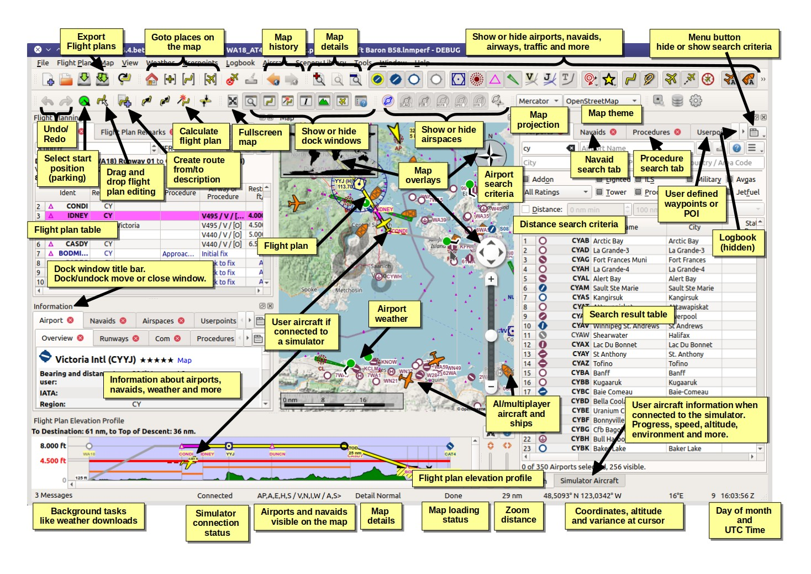
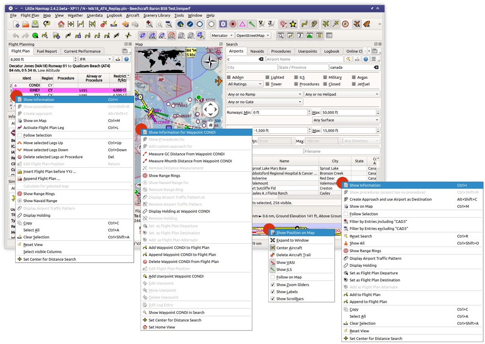
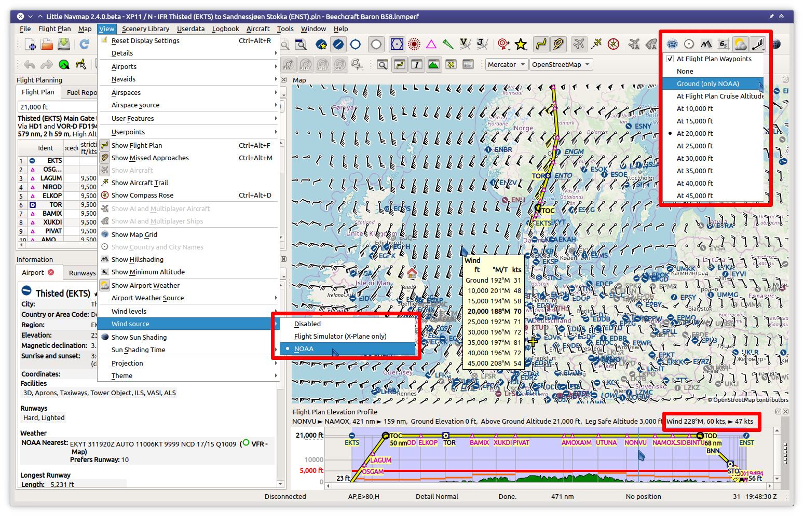
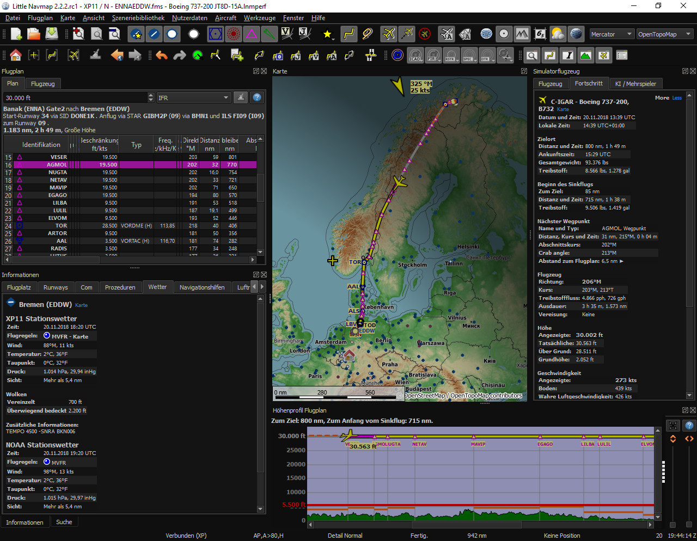
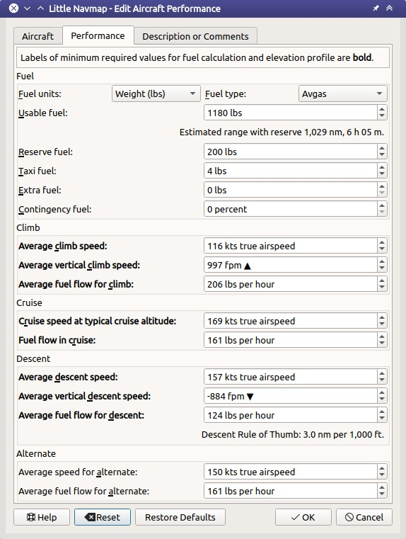

[Alex’ Projects](index.html) ► Little Navmap Screenshots

# Screenshots

See also:

[**► Screenshots of new 2.8 Features**](/pages/28/littlenavmapscreens.html)

[**► Screenshots of new 2.6 Features**](/pages/26/littlenavmapscreens.html)

----

Click on image for full size.

Note that some screenshots are from older versions.

 

**Little Navmap 2.6.6 overview:**

  

**Little Navmap 2.6.6 all context menus:**

  

**Little Navmap 2.6.6 help:**

  

**Little Navmap 2.4.4. Winds aloft forecast for display and fuel planning:**

  

**Little Navmap 2.4.4. Logbook functionality with three entries selected in search which are highlighted on the map:**

  

**Little Navmap 2.4.4. Add holdings at navaids or any place:**

  

**Little Navmap 2.2.2 spherical map projection and elevation profile with flight plan:**

  

**Little Navmap 2.2.2 airport weather and legend:**

  

**Little Navmap 2.2.2 sun shadow on globe:**

  

**Little Navmap 2.4.4. Aircraft performance edit dialog:**

  

**Little Navmap 2.4.4. Permanent performance collection and merge:**

  

**Little Navmap 2.2.2 airport traffic pattern and elevation profile with ILS and VASI:**

  

**Little Navmap 2.4.4. Map page in Firefox browser served by Little Navmap:**

  

**Little Navmap 2.0.2 overview of user defined waypoint functionality:**

  

**Little Navmap 2.0.2 overview of online network functionality:**

  

**Little Navmap 2.0.2 Compass Rose:**

  

**Little Navmap 1.4.0.beta airspaces:**

  

**Little Navmap 1.4.0.beta approach procedure:**

  

**Little Navmap 1.2.4 with map and sourrounding docked windows showing airport Hamburg runway overview and ILS feathers:**

  

**High level view of the airport diagram of EDDH (version 1.2.4):**

  

**Detailed view of the airport diagram. Shows blue gates on the right and a few green general aviation ramp parking on the left. Long displaced threshold of runway 33 is visible (version 1.2.4):**

  

**Little Navmap on Apple macOS (version 1.2.4):**

  

**Little Navmap on Ubuntu Linux (version 1.2.4):**

  

**Little Navmap on Ubuntu Linux connected to a flight simulator (version 1.2.4):**

  

**Tooltip showing airport information (version 1.2.4):**

  

**A complex search: Find all airports within a distance between 200 and 400 nautical miles from Frankfurt (EDDF). Airports should have a rating greater than 0 and should have at least one lighted runway. Military and closed airports are excluded. The resulting airports are highlighted on the map by selecting them in the search result table (version 1.2.4):**

  

**All dock windows removed from main window (version 1.2.4):**

  

**View at a Swiss airport using OpenStreetMap theme and hill shading (version 1.2.4):**

  

**View at a Swiss airport using OpenTopoMap theme (version 1.2.4):**

  

**Drag and drop route editing: Replacing VOR TRA in the flight plan with another one by simply clicking and moving the waypoint TRA onto KLO. Selection menu pops up for disambiguation (version 1.2.4):**

